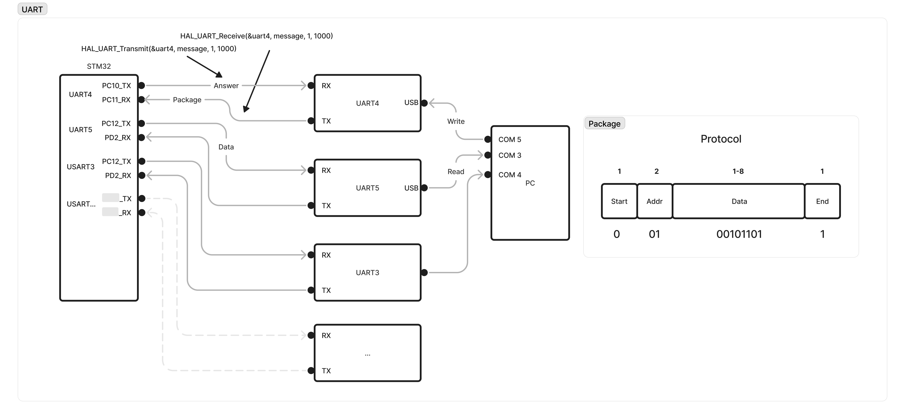

# FreeOS UART Transactions

## Overview

Transactions system for sending data by UART and using FreeOS.
Program allow to control distribution of incoming data from UART on
stm32 processor core to other UART connected components using simple protocol.

*UART scheme*

### Features:

- Using real-time FreeOS tasks
- Synchronization bits at the start and end of package
- Connect up to 4 UART slaves and more with little code changes

## Build with

- Cube IDE
- VS Code

## Author

- Github - [@Ilya Chichkov](https://github.com/IlyaChichkov?tab=repositories)
- Email - ilya.chichkov.dev@gmail.com